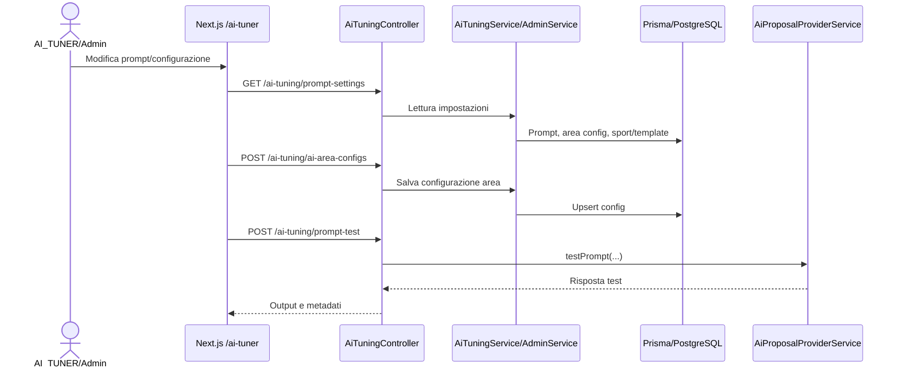
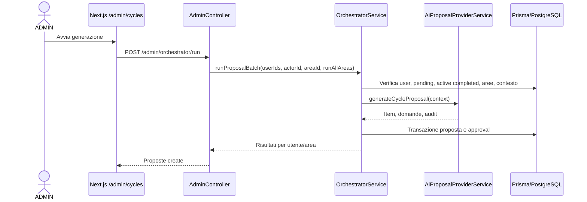
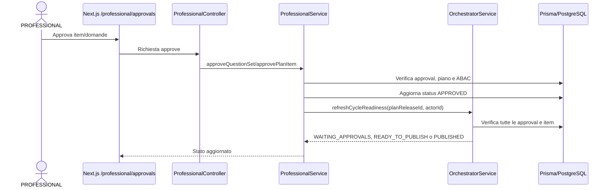
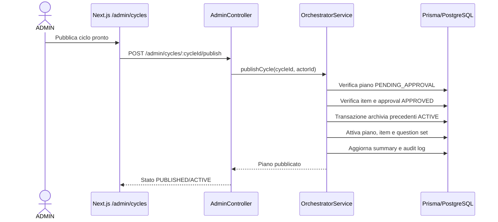

# Flusso AI orchestrator e prompt

## Scopo

L'AI orchestrator genera proposte di ciclo per piani di miglioramento utente, usando contesto prestazionale, area sportiva, configurazioni prompt e provider AI. Il risultato non diventa immediatamente piano attivo: passa da proposta `PENDING_APPROVAL`, approvazione professionale e pubblicazione.

Il backend rimane il confine autorizzativo: il frontend espone pagine per `ADMIN`, `PROFESSIONAL`, `AI_TUNER` e `USER`, ma ruoli e ABAC sono verificati da guard e servizi NestJS.

## File principali

| Area | File |
| --- | --- |
| Orchestrator service | `apps/api/src/ai-orchestrator/orchestrator.service.ts` |
| Provider AI | `apps/api/src/ai-orchestrator/proposal-provider.service.ts` |
| Admin API | `apps/api/src/admin/admin.controller.ts`, `apps/api/src/admin/dto/run-cycle.dto.ts` |
| AI tuning API | `apps/api/src/ai-tuning/ai-tuning.controller.ts`, `apps/api/src/ai-tuning/ai-tuning.service.ts` |
| Professional approvals | `apps/api/src/professional/professional.controller.ts`, `apps/api/src/professional/professional.service.ts` |
| User plan | `apps/api/src/user-plan`, `apps/web/app/user/plan/page.tsx` |
| Admin UI cicli | `apps/web/app/admin/cycles/page.tsx` |
| Professional UI | `apps/web/app/professional/approvals/page.tsx` |
| AI tuner UI | `apps/web/app/ai-tuner`, `apps/web/app/ai-tuner/*` |
| Schema dati | `apps/api/prisma/schema.prisma` |
| Test principali | `apps/api/test/ai-orchestrator.e2e-spec.ts`, `apps/api/test/admin-cycles.e2e-spec.ts`, `apps/api/test/professional-approvals.e2e-spec.ts` |

## Attori e ruoli

| Attore | Ruolo |
| --- | --- |
| `USER` | Riceve piani pubblicati, vede il piano corrente e completa item attivi. |
| `PROFESSIONAL` | Approva o rifiuta domande e item piano per utenti/aree collegati. |
| `ADMIN` | Avvia generazione proposte, usa preview e può pubblicare cicli da endpoint admin. |
| `AI_TUNER` | Gestisce configurazioni prompt, template anamnesi, replay, golden context, valutazioni e costi. |
| Provider AI | Implementato da `AiProposalProviderService`; può essere `stub`, `openai` o `gemini`. |
| Orchestrator | Coordina controlli, contesto, chiamata AI, persistenza e lifecycle piano. |

## Concetti principali

| Concetto | Significato nel codice |
| --- | --- |
| Prompt | Istruzioni usate dal provider AI per generare proposte, validare obiettivi o generare domande onboarding. |
| Versione prompt | Costanti nel provider, ad esempio `cycle-proposal-v2`, `goal-validation-v1`, `specialist-onboarding-questions-v1`. |
| Configurazione area | `AiAreaGenerationConfig`, letta per area durante preview/generazione. |
| Golden context | Contesto salvato da audit o creato manualmente per valutazioni comparative. |
| Replay | Riesecuzione di un prompt da audit o golden context con configurazione corrente o override. |
| Evaluation | Esecuzione asincrona di varianti contro golden context, con risultati valutabili. |
| Audit | Record `AiProposalAudit` con input/output, provider, modello, prompt, token e durata. |
| Proposta/ciclo | `ImprovementPlanRelease` in stato `PENDING_APPROVAL` con item `PROPOSED` e `QuestionSet` collegato. |
| Piano attivo | `ImprovementPlanRelease` pubblicato con status `ACTIVE` e item `ACTIVE`. |
| Piano archiviato | Piano attivo precedente portato a `ARCHIVED` durante pubblicazione del nuovo ciclo. |
| Approval | `QuestionSetAreaApproval` e status item piano usati per verificare approvazione professionale. |
| Area/specializzazione | Area prestazionale scelta da admin o derivata da `UserSportSelection` e `SportSpecializationAreaPrompt`. |
| `runAllAreas` | Se `true`, l'orchestrator genera cicli per tutte le aree abilitate per l'utente; se `areaId` è presente non può essere `true`. |

## Prompt management e AI tuner

| UI | Endpoint principali | Ruolo backend | Persistenza/effetto |
| --- | --- | --- | --- |
| `/ai-tuner/prompts` | `GET /ai-tuning/prompt-settings`, `POST /ai-tuning/goal-prompt`, `POST /ai-tuning/ai-area-configs`, `POST /ai-tuning/sports` | Prevalentemente `AI_TUNER`; alcuni read anche `ADMIN` | Aggiorna impostazioni AI, prompt obiettivo, configurazioni area e sport. |
| `/ai-tuner/anamnesi` | `GET /ai-tuning/prompt-settings`, `POST /ai-tuning/onboarding-templates`, `DELETE /ai-tuning/onboarding-templates/:id` | `AI_TUNER` | Gestisce template domande onboarding. |
| `/ai-tuner/audits` e dettaglio | `GET /ai-tuning/audits`, `GET /ai-tuning/audits/:id`, `POST /ai-tuning/replays`, `POST /ai-tuning/golden-contexts/from-audit/:auditId` | `AI_TUNER`/`ADMIN` secondo decoratori controller | Consulta audit e crea replay/golden context. |
| `/ai-tuner/replays` | `GET /ai-tuning/replays`, `GET /ai-tuning/replays/:id`, `POST /ai-tuning/replays/:id/feedback` | Utente autenticato con ruolo AI tuning/admin | Storico replay e feedback. |
| `/ai-tuner/golden-contexts` | `GET/POST/PATCH/DELETE /ai-tuning/golden-contexts` | Ruoli AI tuning/admin | CRUD contesti golden. |
| `/ai-tuner/evaluations` | `GET/POST /ai-tuning/evaluations`, `GET /ai-tuning/evaluations/:id`, rating risultati | Ruoli AI tuning/admin | Crea run valutazioni, esecuzione asincrona con `setImmediate`. |
| `/ai-tuner/cost` | `GET /ai-tuning/cost` | Ruoli AI tuning/admin | Aggrega token/costi da audit e replay. |

L'orchestrator sceglie prompt/configurazione leggendo configurazioni area, scala, istruzioni utente per area e istruzioni sport/specializzazione. Se manca una configurazione area, il codice usa fallback presenti nel service/provider dove previsti; se manca una scala attiva, viene usato un default interno.

## Generazione proposta

| Step | Dettaglio |
| --- | --- |
| Trigger | Admin UI `/admin/cycles` chiama `POST /admin/orchestrator/run`. |
| DTO | `RunCycleDto` con `userIds`, opzionale `areaId`, opzionale `runAllAreas`. |
| Guard | Endpoint admin protetto da `AuthenticatedGuard` e `RolesGuard` con ruolo `ADMIN`. |
| Validazioni iniziali | `userIds` non vuoto; se `areaId` e `runAllAreas` sono entrambi presenti viene sollevato `BadRequestException`. |
| Scelta aree | Con `areaId` usa una sola area; con `runAllAreas` carica aree abilitate per specializzazione utente; senza selezione sport usa tutte le aree. |
| Idoneità utente | Utente deve esistere, ruolo `USER`, `isActive = true`. |
| Consenso AI | Se provider esterno richiede consenso, viene verificato il consenso AI utente. |
| Blocchi ciclo | Nessun piano `PENDING_APPROVAL` esistente per utente/area; eventuale piano attivo precedente deve avere item completati e questionario chiuso. |
| Contesto | Snapshot precedente, piano precedente, storico recente, summary ciclo, onboarding, current state, configurazioni area/scala/sport. |
| Provider | `AiProposalProviderService.generateCycleProposal` produce item piano, domande e audit dati. |
| Persistenza | Transazione crea `ImprovementPlanRelease`, `PlanItem`, `QuestionSet`, `Question`, `QuestionSetAreaApproval`, `AiContextSummary`, `AiProposalAudit`, `CycleAuditLog`. |

Il metodo `runProposalBatch` esegue i cicli in modo sincrono e sequenziale con `await`. Non emerge una coda o un job runner per la generazione ordinaria.

## Approval flow

| Azione | Endpoint/UI | Regole | Effetto |
| --- | --- | --- | --- |
| Inbox professional | `/professional/approvals`, `GET /professional/approvals` | Deve essere `PROFESSIONAL`; il servizio filtra utenti/aree collegati. | Mostra item piano, question approval e training approval rilevanti. |
| Approva question set | Endpoint professional di approvazione question set | Approval deve essere `PENDING`; ABAC su utente/area. | `QuestionSetAreaApproval.status = APPROVED`; richiama readiness ciclo. |
| Rifiuta question set | Endpoint professional di rifiuto question set | Richiede motivazione; ABAC su utente/area. | Approval `REJECTED`; proposta ciclo viene chiusa/rifiutata. |
| Approva plan item | Endpoint professional plan item | Item deve essere `PROPOSED`, piano `PENDING_APPROVAL`, ABAC valido. | `PlanItem.status = APPROVED`; richiama readiness ciclo. |
| Rifiuta plan item | Endpoint professional plan item reject | Richiede motivazione e ABAC valido. | Item `REJECTED`; proposta ciclo rifiutata. |

La readiness viene ricalcolata da `OrchestratorService.refreshCycleReadiness`: se tutte le approvazioni e tutti gli item sono approvati, il ciclo passa a `READY_TO_PUBLISH`; quando viene passato un `actorId`, il servizio chiama anche `publishCycle`.

## Pubblicazione

| Step | Comportamento |
| --- | --- |
| Trigger admin | `POST /admin/cycles/:cycleId/publish` con ruolo `ADMIN`. |
| Validazione | Piano deve essere `PENDING_APPROVAL`; tutti gli item devono essere `APPROVED`; il `QuestionSet` deve essere `PENDING_APPROVAL`; tutte le approval devono essere `APPROVED`. |
| Transazione | Archivia piani `ACTIVE` precedenti per stesso utente/area, attiva il piano corrente, attiva gli item, pubblica il question set, aggiorna summary, scrive audit log. |
| Stato finale | `ImprovementPlanRelease.status = ACTIVE`, `cycleStatus = PUBLISHED`, `PlanItem.status = ACTIVE`, `QuestionSet.status = PUBLISHED`. |
| Piani precedenti | Status `ARCHIVED`, `archivedAt` valorizzato. |

Nota: il path di servizio `refreshCycleReadiness(planReleaseId, actorId)` può arrivare da approvazioni professional e invocare `publishCycle` se il ciclo è pronto. Questo comportamento è reale nel codice e va chiarito come decisione di business/autorizzazione, perché l'endpoint diretto di publish è invece admin-only.

## Runtime e failure mode

| Tema | Comportamento osservato |
| --- | --- |
| Sincronia | La generazione proposta è sincrona e sequenziale nel processo HTTP/service. |
| Provider test | I test usano provider stub/deterministico o mock di orchestrator/provider. |
| Provider esterni | `openai` e `gemini` richiedono chiavi env e consenso AI utente quando previsto. |
| Audit | Gli audit proposta vengono creati nella transazione dopo una generazione provider riuscita. |
| Fallimento provider | Se il provider fallisce prima della transazione, non è evidente un audit persistito di fallimento per quel ciclo. |
| `runAllAreas` | Ogni area viene salvata con propria transazione; una failure successiva può lasciare cicli precedenti già creati. |
| Valutazioni AI tuner | Le evaluation run sono avviate e poi processate in background con `setImmediate`; non è lo stesso runtime della generazione ciclo admin. |
| Costi | `AiTuningService.getCostSummary` aggrega token/metadati da audit e replay. |

## Cambiamenti di stato database

| Modello | Quando viene toccato | Campi rilevanti |
| --- | --- | --- |
| `ImprovementPlanRelease` | Creazione proposta, readiness, publish, reject | `status`, `cycleStatus`, `version`, `areaId`, `publishedAt`, `archivedAt`, `proposedByAdminId`. |
| `PlanItem` | Creazione proposta, approval professional, publish, reject, completamento user | `status`, `approvedByProfessionalId`, `approvedAt`, `rejectedAt`, `completedAt`. |
| `QuestionSet` | Creazione proposta, publish, reject, chiusura | `status`, `type`, `planReleaseId`, `publishedAt`. |
| `Question` | Creazione proposta | Testo, opzioni, ordine, collegamento al question set. |
| `QuestionSetAreaApproval` | Creazione proposta e approval professional | `status`, `professionalId`, `areaId`, `approvedAt`, `rejectionReason`. |
| `ProfessionalUserLink`/`coachUserLink` | ABAC e collegamento professionista/utente | Verifica accesso a utente/area. |
| `UserSportSelection` | Selezione aree in `runAllAreas` | `sportId`, `specializationId`. |
| `SportSpecializationAreaPrompt` | Driver area/prompt per specializzazione | `isActive`, `isEnabledDriver`, prompt instruction. |
| `AiAreaGenerationConfig` | Config area per generazione | Parametri di prompt/generazione area. |
| `AiProposalAudit` | Audit generazione | Provider, modello, prompt version/hash, input/output, token, status. |
| `AiPromptReplay` | Replay AI tuner | Input/output, status, token, feedback. |
| `AiGoldenContext` | Golden context | Contesto salvato per valutazioni. |
| `AiEvaluationRun`/`AiEvaluationResult` | Evaluation AI tuner | Stato run, varianti, risultati, rating. |
| `AiContextSummary` | Summary ciclo | `cycleStatus`, contesto sintetico. |
| `CycleAuditLog` | Eventi ciclo | `PROPOSAL_RUN`, `PUBLISH`, `REJECT`. |

## Diagramma: configurazione prompt AI tuner

## Diagramma: admin genera proposta

## Diagramma: professional approval

## Diagramma: pubblicazione proposta

## State machine lifecycle piano/proposta

| Stato | Significato | Creato da | Prossimi stati | Regole/blocchi | Riferimenti |
| --- | --- | --- | --- | --- | --- |
| `PENDING_APPROVAL` + `WAITING_APPROVALS` | Proposta AI creata ma non approvata | `runCycleForArea` | `READY_TO_PUBLISH`, `REJECTED` | Richiede approval professional e item approvati. | `ai-orchestrator.e2e-spec.ts` |
| `READY_TO_PUBLISH` | Tutte le approvazioni risultano complete | `refreshCycleReadiness` | `ACTIVE`/`PUBLISHED`, `REJECTED` | Può essere pubblicato se le condizioni restano valide. | `professional-approvals.e2e-spec.ts` |
| `ACTIVE` + `PUBLISHED` | Piano visibile all'utente | `publishCycle` | `ARCHIVED`, completamento item | Prima di generare nuovo ciclo, item attivi e questionario devono essere completati/chiusi. | `user-plan.e2e-spec.ts`, `ai-orchestrator.e2e-spec.ts` |
| `ARCHIVED` | Piano attivo precedente sostituito | `publishCycle` di un nuovo ciclo | Nessuno ordinario | Creato solo per precedenti piani `ACTIVE` stessa area/utente. | `ai-orchestrator.e2e-spec.ts` |
| `REJECTED` + `CLOSED` | Proposta rifiutata | `rejectCycleProposal` | Nuova proposta futura | Rilascia il blocco pending. | `ai-orchestrator.e2e-spec.ts` |
| Questionario `CLOSED` | Domande del ciclo concluse | Flussi question/answers | Consente nuovo ciclo | Necessario per superare `assertPreviousCycleCompleted`. | `questions-approvals.e2e-spec.ts` |

## Test che coprono il flusso

| Test | Cosa verifica |
| --- | --- |
| `apps/api/test/ai-orchestrator.e2e-spec.ts` | Generazione per tutte le aree, generazione area singola, publish dopo approval, archiviazione piano precedente, blocco publish senza approval, blocco nuovo ciclo se attività precedente non completata, reject e rilascio blocco pending. |
| `apps/api/test/admin-cycles.e2e-spec.ts` | Endpoint admin per run/publish, accesso negato a ruoli non autorizzati. |
| `apps/api/test/professional-approvals.e2e-spec.ts` | Inbox professional filtrata per collegamenti, doppia approvazione bloccata, admin può leggere status ma non approvare, reject richiede ragione, non-professional bloccato. |
| `apps/api/test/questions-approvals.e2e-spec.ts` | Utente non vede question set pending, professional senza competenza non approva, chiusura consentita solo su question set pubblicati. |
| `apps/api/test/user-plan.e2e-spec.ts` | Utente vede piano attivo corrente, isolamento tra utenti, completamento item attivi, rifiuto item non attivi o di altro utente. |
| `apps/api/test/performance.e2e-spec.ts` | ABAC professional per vista performance utente. |

## Gap e ambiguità note

| Tema | Dettaglio |
| --- | --- |
| Pubblicazione da approval | `refreshCycleReadiness(planReleaseId, actorId)` può invocare `publishCycle` dopo azione professional; l'endpoint diretto è admin-only. Serve conferma se l'auto-publish da professional è voluto. |
| Partial failure `runAllAreas` | La generazione usa transazioni per singola area. Se una delle aree successive fallisce, quelle precedenti possono risultare già persistite. |
| Audit fallimenti provider | Il percorso principale crea `AiProposalAudit` dopo una risposta provider riuscita; non è evidente un audit persistito per errori provider prima della transazione. |
| Copertura DB reale | I test orchestrator osservati usano fake/mocking Prisma; la copertura PostgreSQL reale è limitata a smoke test separati. |
| Frontend tests | Le pagine admin/professional/ai-tuner non hanno copertura frontend reale configurata. |
| Evaluation status | Nel service AI tuning, una evaluation con risultati falliti viene comunque marcata `COMPLETED`; è da verificare se sia intenzionale. |
| Naming stati | Coesistono `status` e `cycleStatus` su piano, più status su question set e item; la semantica è corretta nel codice ma richiede attenzione nelle UI. |
| Config mancanti | Alcuni fallback sono implementati internamente; non tutte le assenze di configurazione generano errori espliciti. |
