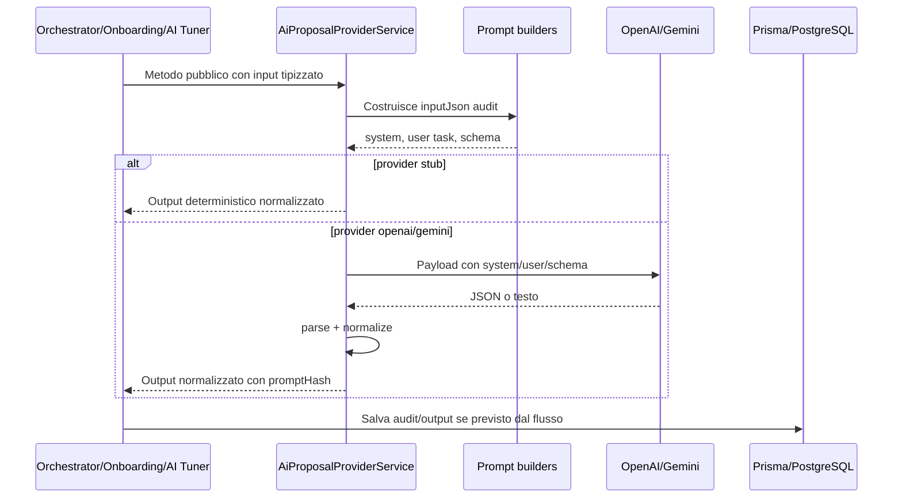

# Costruzione dei prompt AI

## Scopo

Questo documento descrive come il backend costruisce i prompt inviati alla API AI per ogni tipologia attualmente presente nel codice. La fonte principale e `apps/api/src/ai-orchestrator/proposal-provider.service.ts`, con i dati preparati da `apps/api/src/ai-orchestrator/orchestrator.service.ts`, `apps/api/src/onboarding/onboarding.service.ts` e `apps/api/src/ai-tuning/ai-tuning.service.ts`.

Il provider viene scelto da `AI_PROVIDER`:

| Provider | API chiamata | Modello default | Note |
| --- | --- | --- | --- |
| `stub` | Nessuna chiamata esterna | `deterministic-stub` | Genera output deterministico locale. |
| `openai` | `POST https://api.openai.com/v1/responses` | `AI_MODEL_PROPOSAL` oppure `gpt-5.4-mini` | Usa `input` con messaggi `system` e `user`; quando previsto forza JSON schema. |
| `gemini` | `POST https://generativelanguage.googleapis.com/v1beta/models/:model:generateContent` | `GEMINI_MODEL_PROPOSAL` oppure `gemini-2.5-flash` | Usa `systemInstruction`, `contents` e `generationConfig.responseJsonSchema`. |

Ogni prompt strutturato genera anche un `promptHash`, calcolato come SHA-256 del JSON di audit costruito dal provider.

I prompt amministrativi modificabili hanno anche uno storico immutabile in `AiPromptVersion`. Questo storico non sostituisce le costanti runtime del provider: conserva le modifiche ai record correnti usati da orchestrator, onboarding e AI tuner.

## Vista d'insieme

| Tipologia prompt | Metodo pubblico | Versione | Chiamanti principali | Output atteso |
| --- | --- | --- | --- | --- |
| Proposta ciclo area | `generateCycleProposal` | `cycle-proposal-v2` | `OrchestratorService.runCycleForArea`, preview admin, replay, evaluation | Item piano, domande monitoraggio, audit. |
| Proposta allenamento specifico | `generateCycleProposal` | `cycle-proposal-v2` | `OrchestratorService.runTrainingPlan`, preview training | Item allenamento, domande training, audit. |
| Sunto storico ciclo | `summarizeCycleHistory` | `cycle-history-summary-v1` | `loadOrCreateOlderCyclesSummary` | Summary tecnico per prompt futuri. |
| Validazione obiettivo | `validatePerformanceGoal` | `goal-validation-v1` | Onboarding goal validate/refine/final validate | Stato obiettivo, normalizzazione, domande utente, prompt area. |
| Domande onboarding specialistiche | `generateSpecialistOnboardingQuestions` | `specialist-onboarding-questions-v1` | Onboarding specialist questions | Tre domande score per area. |
| Test prompt libero | `testPrompt` | Nessuna costante dedicata | AI tuner prompt test | Testo libero generato dal provider. |

Replay ed evaluation non hanno un prompt builder diverso: ricostruiscono un `CycleProposalInput` e poi riusano `generateCycleProposal`.

## Versioni amministrative immutabili

| Prompt modificabile | Record corrente letto dai flussi | Storico immutabile |
| --- | --- | --- |
| Validazione obiettivo | `AiGoalPromptConfig.basePrompt`, `version` | `AiPromptVersion` con `promptType = GOAL`. |
| Proposta ciclo area | `AiAreaGenerationConfig.initialContext`, `responseFormatPrompt`, `questionnaireLayoutJson`, `version` | `AiPromptVersion` con `promptType = AREA_GENERATION`. |
| Prompt area sport/specializzazione | `SportSpecializationAreaPrompt.basePrompt`, `version` | `AiPromptVersion` con `promptType = SPORT_AREA`. |
| Allenamento specifico | `SportSpecialization.trainingPrompt`, `trainingPromptVersion` | `AiPromptVersion` con `promptType = TRAINING`. |

Su ogni create/update il backend crea una nuova riga `AiPromptVersion` e aggiorna il puntatore attivo sul record corrente. Le versioni vecchie non vengono sovrascritte. La migration iniziale crea una versione 1 per i record gia presenti e collega i record alla versione attiva.

## Anatomia comune

Per OpenAI il payload contiene:

| Campo | Origine |
| --- | --- |
| `model` | `resolveModel(provider)` |
| `input[0].role = system` | Prompt di sistema o prompt base configurato. |
| `input[1].role = user` | JSON serializzato del task specifico. |
| `text.format` | JSON schema quando il prompt richiede output strutturato. |

Per Gemini il payload equivalente contiene:

| Campo | Origine |
| --- | --- |
| `systemInstruction.parts[0].text` | Prompt di sistema o prompt base configurato. |
| `contents[0].parts[0].text` | JSON serializzato del task specifico. |
| `generationConfig.responseMimeType` | `application/json` per prompt strutturati. |
| `generationConfig.responseJsonSchema` | Schema JSON equivalente a quello OpenAI. |

Il JSON di audit viene salvato o restituito con una struttura `prompt` che include:

| Campo audit | Significato |
| --- | --- |
| `prompt.system` | Testo finale usato come system prompt. |
| `prompt.user` | Oggetto task inviato come messaggio user. |
| `prompt.responseJsonSchema` | Schema atteso, quando presente. |

Quando disponibili, i blocchi `guidance` includono anche la versione amministrativa e l'identificativo della versione attiva usata come fonte del prompt corrente. Gli audit storici precedenti alla migration restano ricostruibili dal loro `inputJson`, ma non sono retro-collegati a una riga `AiPromptVersion`.

Se `AI_DEBUG_PROMPT_LOG=true`, il servizio logga provider, modello e blocco `prompt` dell'input audit.

## 1. Proposta ciclo area

### Chiamata

| Elemento | Dettaglio |
| --- | --- |
| Metodo | `AiProposalProviderService.generateCycleProposal(input)` |
| Chiamante principale | `OrchestratorService.runCycleForArea` |
| Preview | `OrchestratorService.previewCycleProposalInput` usa `buildCycleProposalPreview` senza chiamare provider esterno. |
| Versione | `cycle-proposal-v2` |

### Preparazione input orchestrator

`OrchestratorService.prepareCycleProposalInput` costruisce un `CycleProposalInput` dopo questi controlli:

| Dato/controllo | Fonte |
| --- | --- |
| Utente valido | `User.role = USER` e `User.isActive = true`. |
| Pending esistente | Nessun `ImprovementPlanRelease` `PENDING_APPROVAL` per utente/area. |
| Ciclo precedente | Eventuale piano attivo deve essere completato e questionario chiuso. |
| Consenso AI | Obbligatorio per provider esterni `openai` e `gemini`. |
| Snapshot | Ultimo `PerformanceProfileSnapshot` con aree. |
| Storico recente | Ultimi tre cicli area, compattati per prompt. |
| Storico vecchio | `AiCycleHistorySummary`, creato se necessario con prompt di sunto storico. |
| Anamnesi | `UserOnboardingAssessment.answersJson` e `profileJson`. |
| Stato corrente | `CurrentState` per area. |
| Config area | `AiAreaGenerationConfig`. |
| Prompt area utente | `UserAreaPromptInstruction`, generato durante validazione finale onboarding. |
| Prompt sport-specializzazione | `SportSpecializationAreaPrompt` attivo e driver per specializzazione/area. |

### System prompt

Il system prompt viene costruito da `buildSystemPrompt` come concatenazione di sezioni:

| Ordine | Sezione | Fonte |
| --- | --- | --- |
| 1 | Base prompt area | `AiAreaGenerationConfig.initialContext`; fallback costante `SYSTEM_PROMPT`. |
| 2 | Forma risposta configurata | `AiAreaGenerationConfig.responseFormatPrompt`, se presente. |
| 3 | Prompt area personalizzato atleta | `UserAreaPromptInstruction.promptText`, ripulito da istruzioni sport incorporate. |
| 4 | Prompt sport-specializzazione corrente | `SportSpecializationAreaPrompt.basePrompt`, se presente e attivo. |

Il prompt sport-specializzazione corrente viene dichiarato prevalente rispetto a eventuali istruzioni sport vecchie presenti nello storico.

### User prompt

Il messaggio user e l'oggetto prodotto da `buildProposalPrompt`:

| Campo | Contenuto |
| --- | --- |
| `task` | Richiede una proposta specifica per area e il numero vincolato di domande. |
| `constraints.questions` | Numero domande calcolato da `questionnaireLayoutJson`, massimo 10, default 3. |
| `constraints.answerOptions` | Opzioni da layout area o default: `Non ancora`, `A volte`, `Spesso`, `Con costanza`. |
| `constraints.responseFormat` | `responseFormatPrompt` della config area o fallback tecnico. |
| `constraints.questionnaireLayout` | Layout raw dell'area. |
| `constraints.scoreRange` | Scala performance attiva o default orchestrator. |
| `constraints.planItems` | Min 1, max 3, con azione chiara, frequenza/trigger, criterio misurabile e progressione. |
| `constraints.questionsMustMeasure` | Esecuzione osservabile o aderenza al lavoro generato. |
| `context` | `buildModelContext`, cioe contesto atleta senza il blocco `guidance`. |

`buildModelContext` rimuove volutamente `context.guidance` dal payload user per evitare di duplicare istruzioni gia inserite nel system prompt.

### Schema risposta

`buildProposalJsonSchema` richiede:

| Campo | Regole |
| --- | --- |
| `summaryText` | Stringa. |
| `planItems` | Array 1..3, ogni item ha `type`, `title`, `body`. |
| `questions` | Array con numero esatto richiesto dal layout, ogni domanda ha `text`, `objectiveRef`, `orderIndex`. |

La normalizzazione rifiuta la risposta se non ci sono item validi o se il numero domande non corrisponde al layout.

### Persistenza audit

`runCycleForArea` salva `proposal.audit.inputJson` e `proposal.audit.outputJson` in `AiProposalAudit`, insieme a provider, modello, versione, hash, token e latenza.

## 2. Proposta allenamento specifico

La proposta allenamento usa lo stesso metodo `generateCycleProposal` e quindi la stessa versione `cycle-proposal-v2`, ma l'orchestrator costruisce un input diverso con `prepareTrainingProposalInput`.

| Aspetto | Differenza rispetto al ciclo area |
| --- | --- |
| Area sintetica | `{ id: 'training', name: 'Allenamento specifico' }`. |
| Prompt base | Creato inline: chiede un allenamento autonomo e specifico per sport-specializzazione, non un ciclo specialistico di area. |
| Response format | Chiede struttura, intensita, volume, recuperi, criteri di successo, progressione e domande monitoraggio. |
| Layout questionario | 3 domande con opzioni training: `Non completato`, `Parziale`, `Completato`, `Completato bene`. |
| Prompt utente area | Se esiste goal, viene inserito come `Obiettivo atleta: ...` con versione `training-goal-context-v1`. |
| Prompt training | `SportSpecialization.trainingPrompt`, se attivo, viene aggiunto nel system prompt come sezione allenamento specifico. |
| Snapshot | Filtrato alle aree abilitate per la specializzazione utente. |

Il risultato viene poi persistito nei modelli training (`TrainingPlanRelease`, item training, question set training e audit collegato), non nei modelli area ordinari.

## 3. Sunto storico ciclo

### Chiamata

| Elemento | Dettaglio |
| --- | --- |
| Metodo | `summarizeCycleHistory(input)` |
| Versione | `cycle-history-summary-v1` |
| Chiamante | `OrchestratorService.loadOrCreateOlderCyclesSummary` |
| Quando parte | Quando esistono cicli piu vecchi oltre agli ultimi tre e non esiste gia un summary con lo stesso hash sorgente. |

### System prompt

Per provider reali il system prompt chiede di riassumere lo storico atleta per uso tecnico in prompt futuri, solo JSON valido, in italiano, senza inventare dati non presenti.

### User prompt

`buildHistorySummaryPrompt` costruisce:

| Campo | Contenuto |
| --- | --- |
| `task` | Produrre un sunto tecnico dei cicli storici vecchi da aggiungere ai prompt futuri. |
| `scope` | `AREA` o `TRAINING`. |
| `targetLabel` | Nome area o sport/specializzazione training. |
| `coveredCycles` | Cicli compattati, in ordine cronologico. |
| `rules` | Usare solo dati presenti, distinguere fatti da inferenze prudenti, conservare elementi utili per il prossimo prompt. |
| `outputShape` | Richiede `summaryText` e liste operative. |

### Schema risposta

`buildHistorySummaryJsonSchema` richiede:

| Campo | Tipo |
| --- | --- |
| `summaryText` | Stringa. |
| `stableSignals` | Lista stringhe, massimo 12. |
| `completedWork` | Lista stringhe, massimo 12. |
| `unresolvedRisks` | Lista stringhe, massimo 12. |
| `progressionNotes` | Lista stringhe, massimo 12. |

Il risultato viene salvato in `AiCycleHistorySummary` con `sourceHash`, versioni coperte, provider, modello, versione prompt e hash.

## 4. Validazione obiettivo

### Chiamata

| Elemento | Dettaglio |
| --- | --- |
| Metodo | `validatePerformanceGoal(input)` |
| Versione | `goal-validation-v1` |
| Chiamanti | `OnboardingService.validateGoal`, `refineGoal`, `validateFinalGoal` |
| Prompt base | `GoalValidationInput.basePrompt`, caricato dalla configurazione `AiGoalPromptConfig` o fallback admin. |

### Fasi

`buildGoalValidationTask` distingue due fasi:

| Fase | Condizione | Effetto sulle regole |
| --- | --- | --- |
| `BOZZA_OBIETTIVO_PRIMA_DELL_ANAMNESI` | Mancano `onboardingProfile` e `onboardingAnswers` | Se l'obiettivo e sensato ma mancano dati personali, puo rispondere `NEEDS_ANAMNESIS`. |
| `VALIDAZIONE_FINALE_DOPO_ANAMNESI` | Sono presenti profilo o risposte onboarding | Deve decidere se l'obiettivo e realistico usando anamnesi e risposte specialistiche. |

### System prompt

Il system prompt e direttamente `input.basePrompt`. Per OpenAI viene mandato come messaggio `system`; per Gemini come `systemInstruction`.

### User prompt

Il task di validazione contiene:

| Campo | Contenuto |
| --- | --- |
| `task` | Validare obiettivo Performance Factory e generare prompt specialistici area solo se `status=OK`. |
| `evaluationPhase` | Bozza o validazione finale. |
| `platformPrinciple` | Miglioramento personale rispetto al punto di partenza. |
| `officialAreas` / `availableAreas` | Aree abilitate. |
| `athleteGoal` | Testo obiettivo utente. |
| `sportSelection` | Sport e specializzazione selezionati, se presenti. |
| `sportSpecializationPromptInstructions` | Prompt area per sport/specializzazione, con area, versione e basePrompt. |
| `refinementContext` | Solo nel refine goal: goal originale, bozza corrente, messaggi, risposta utente. |
| `datiAnamnestici` | Profilo onboarding nella validazione finale. |
| `storicoRisposte` | Risposte onboarding nella validazione finale. |
| `statuses` | `OK`, `NEEDS_ANAMNESIS`, `GOAL_NEEDS_REFORMULATION`, `OUT_OF_SCOPE`, `UNSAFE`. |
| `decisionRules` | Regole decisionali specifiche per ogni status. |
| `healthLimits` | Limiti su nutrizione, fisioterapia, sintomi, dolore, farmaci, DCA. |
| `outputRules` | JSON valido, max 3 domande chiarimento, non chiedere dati che appartengono ai questionari, generare area prompt solo se `OK`. |

### Schema risposta

`buildGoalValidationJsonSchema` richiede:

| Campo | Note |
| --- | --- |
| `status` | Uno degli status ammessi. |
| `goal_evaluation` | Oggetto con original goal, sport-related, clear, measurable, safe, legal, issues, reasoning. |
| `message_to_user` | Messaggio leggibile per l'utente. |
| `suggested_reformulated_goal` | Stringa o null. |
| `questions_to_user` | Lista, massimo 5 nello schema; poi normalizzata a massimo 3 e filtrata. |
| `normalized_goal` | Sport/attivita, dimensione performance, livello attuale, miglioramento desiderato, orizzonte, criteri, vincoli. |
| `area_prompts` | Oggetto con chiavi area normalizzate; ogni area e prompt strutturato o null. |
| `next_step` | Indicazione prossimo passo. |

Durante normalizzazione:

| Caso | Comportamento |
| --- | --- |
| Status non valido | Diventa `GOAL_NEEDS_REFORMULATION`. |
| Status diverso da `OK` | `accepted=false`, `areaPrompts=[]`. |
| Status `OK` | Ogni area viene trasformata in `UserAreaPromptInstruction` dal service onboarding. |
| Prompt area mancante/non oggetto | Viene usato fallback `buildFallbackGoalAreaPrompt`. |
| Domande chiarimento vietate | Vengono filtrati riferimenti a frequenza allenamento, dieta, sonno, stress, attrezzatura, infortuni/dolore. |

## 5. Domande onboarding specialistiche

### Chiamata

| Elemento | Dettaglio |
| --- | --- |
| Metodo | `generateSpecialistOnboardingQuestions(input)` |
| Versione | `specialist-onboarding-questions-v1` |
| Chiamante | `OnboardingService.generateSpecialistQuestions` |
| Numero domande | Esattamente 3 per area. |

### System prompt

Il system prompt chiede di generare domande anamnestiche specialistiche per sport performance, solo JSON valido, in italiano, senza diagnosi o prescrizioni cliniche.

### User prompt

`buildSpecialistOnboardingQuestionTask` include:

| Campo | Contenuto |
| --- | --- |
| `task` | Generare esattamente tre domande anamnestiche specialistiche per ogni area ufficiale. |
| `athleteGoal` | Obiettivo utente. |
| `interpretedGoal` | Obiettivo interpretato dalla validazione. |
| `normalizedGoal` | Goal normalizzato, se presente. |
| `sportSelection` | Sport/specializzazione selezionati. |
| `sportSpecializationPromptInstructions` | Prompt sport per area. |
| `generalProfile` | Profilo anamnesi generale. |
| `generalAnswers` | Risposte generali. |
| `areas` | Aree abilitate. |
| `constraints` | Scala score 1-5, personalizzazione, realismo, specificita area, divieti clinici. |

### Schema risposta

`buildSpecialistOnboardingQuestionJsonSchema` richiede `areaQuestions`, con elementi `{ areaId, questions }`, dove ogni `questions` contiene esattamente tre oggetti `{ text, orderIndex }`.

Se una risposta provider non contiene tre domande valide per un'area, il servizio usa `buildFallbackSpecialistQuestions` per quell'area.

## 6. Prompt test libero

### Chiamata

| Elemento | Dettaglio |
| --- | --- |
| Metodo | `testPrompt(input)` |
| Chiamante | `AiTuningService.testPrompt`, endpoint `POST /ai-tuning/prompt-test` |
| Validazione | Prompt trim obbligatorio, minimo 10 caratteri. |
| Provider | `input.provider` oppure provider configurato. |

### System prompt e user payload

Il system prompt dice al provider di agire come tester di prompt Performance Factory, usare il contesto di prova, rispondere in italiano e segnalare ambiguita operative senza inventare dati atleta.

Il messaggio user contiene:

| Campo | Contenuto |
| --- | --- |
| `prompt` | Prompt libero inserito dall'AI tuner. |
| `context` | Contesto libero; se mancante usa un atleta test con obiettivo di miglioramento performance. |

Non viene applicato JSON schema: l'output atteso e testo libero.

## 7. Replay ed evaluation

Replay ed evaluation non costruiscono prompt con un metodo dedicato. Il flusso e:

| Flusso | Costruzione input |
| --- | --- |
| Replay | Legge `AiProposalAudit.inputJson.prompt.user.context`, applica eventuali override di `initialContext` e `responseFormatPrompt`, ricarica config area corrente, poi chiama `generateCycleProposal`. |
| Evaluation | Parte da golden context, applica la variante di configurazione, ricostruisce `CycleProposalInput`, poi chiama `generateCycleProposal`. |

Di conseguenza usano sempre `cycle-proposal-v2` e gli stessi builder:

| Builder riusato | Impatto |
| --- | --- |
| `buildSystemPrompt` | Include config area/override, prompt area utente, prompt sport o training se presenti nel contesto. |
| `buildProposalPrompt` | Produce task, constraints e context. |
| `buildProposalJsonSchema` | Impone output strutturato con item e domande. |

## Diagramma sintetico

## Export prompt attivi

L'endpoint `GET /ai-tuning/active-prompts/export` genera on demand un file `text/plain` scaricabile dalla UI AI tuner. L'endpoint e read-only, richiede autenticazione e ruolo `ADMIN` o `AI_TUNER`, e non scrive file persistenti sul server.

L'export include solo configurazioni correnti e attive:

| Dominio | Fonte |
| --- | --- |
| Prompt obiettivo/onboarding | `AiGoalPromptConfig` attivi. |
| Config generazione area | `AiAreaGenerationConfig` correnti. |
| Prompt sport-specializzazione-area | `SportSpecializationAreaPrompt` attivi sotto sport/specializzazioni attivi. |
| Prompt training | `SportSpecialization.trainingPrompt` quando attivo. |
| Template onboarding | `OnboardingQuestionTemplate` attivi, come configurazione corrente di raccolta contesto. |

Non esporta versioni storiche, audit, replay, evaluation, cost log, dati utente, sessioni, variabili ambiente, segreti o risposte raw provider. Se il puntatore `activePromptVersionId` o `activeTrainingPromptVersionId` manca, l'export usa il campo operativo corrente e segnala il warning nel file.

## Persistenza e tracciabilita

| Flusso | Dove resta traccia |
| --- | --- |
| Proposta ciclo area | `AiProposalAudit`, `AiContextSummary`, `CycleAuditLog`, piano/question set generati. |
| Training | Audit training collegato al piano training, item e question set training. |
| Sunto storico | `AiCycleHistorySummary`. |
| Validazione obiettivo | `UserPerformanceGoal`; nella validazione finale anche `UserAreaPromptInstruction`. |
| Domande specialistiche | `UserOnboardingQuestion` con provider, modello, prompt version/hash e input JSON. |
| Replay | `AiPromptReplay` con input/output/token/correlation. |
| Evaluation | `AiEvaluationRun` e `AiEvaluationResult`. |

## Ambiguita e attenzioni

| Tema | Dettaglio |
| --- | --- |
| Versione unica proposta/training | Ciclo area, training, replay ed evaluation usano tutti `cycle-proposal-v2`; il comportamento cambia dal contesto e dal system prompt, non dalla versione. |
| Fallback silenziosi | Alcuni output incompleti vengono sostituiti da fallback, ad esempio domande onboarding specialistiche o prompt area mancanti dopo goal validation. |
| Audit fallimenti provider | Per le proposte, l'audit persistito viene creato dopo output provider normalizzato; errori prima della transazione possono non produrre `AiProposalAudit`. |
| Context senza guidance | Nel prompt proposta il blocco `guidance` non viene inviato come context user, ma le sue parti rilevanti entrano nel system prompt. |
| Prompt area utente ripulito | `stripEmbeddedSportPromptInstructions` rimuove istruzioni sport incorporate nel prompt area utente, per lasciare prevalere il prompt sport-specializzazione corrente. |
| Differenza preview/esecuzione | La preview admin restituisce `inputJson`, `promptHash`, provider e modello, ma non chiama la API esterna. |
