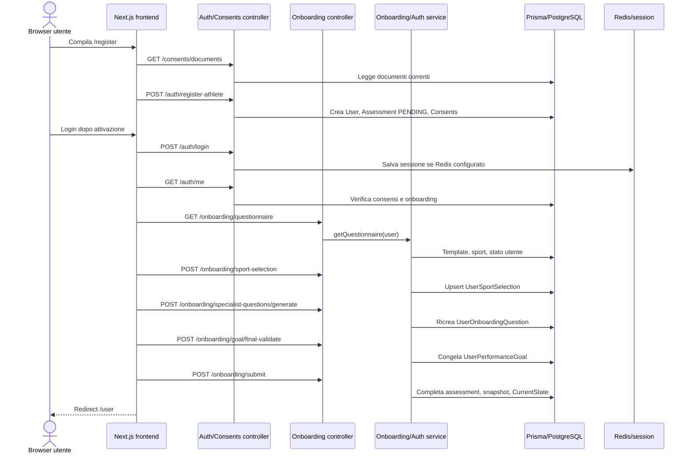

# Flusso di onboarding utente

## Scopo

L'onboarding serve a portare un account con ruolo `USER` da registrato ad utilizzabile nell'area utente. Il flusso raccoglie consensi, scelta sport/specializzazione, anamnesi generale, obiettivo prestazionale e domande specialistiche generate per area.

Il backend considera l'onboarding completato solo quando viene salvata una `UserOnboardingAssessment` con stato `COMPLETED`, esiste un obiettivo prestazionale associato all'utente e l'obiettivo è congelato con `UserPerformanceGoal.frozenAt`.

## File principali

| Area | File |
| --- | --- |
| Registrazione web | `apps/web/app/register/page.tsx` |
| Consensi Google | `apps/web/app/register/google/consents/page.tsx` |
| Consensi autenticati | `apps/web/app/consents/page.tsx` |
| Onboarding web | `apps/web/app/onboarding/page.tsx` |
| Area utente | `apps/web/app/user/page.tsx` |
| API helper frontend | `apps/web/app/lib/api.ts` |
| Auth API | `apps/api/src/auth/auth.controller.ts`, `apps/api/src/auth/auth.service.ts` |
| Consensi API | `apps/api/src/consents/consents.controller.ts`, `apps/api/src/consents/consents.service.ts` |
| Onboarding API | `apps/api/src/onboarding/onboarding.controller.ts`, `apps/api/src/onboarding/onboarding.service.ts` |
| Performance/profile | `apps/api/src/performance/performance.service.ts` |
| Schema dati | `apps/api/prisma/schema.prisma` |

## Attori

| Attore | Ruolo nel flusso |
| --- | --- |
| Visitatore anonimo | Può registrarsi e consultare i documenti di consenso pubblici. |
| `USER` registrato | Completa consensi, scelta sport, anamnesi, obiettivo e submit finale. |
| Admin | Attiva o gestisce l'utente dopo la registrazione; non esegue direttamente l'onboarding utente. |
| Professional | Non partecipa direttamente all'onboarding; può essere coinvolto in flussi successivi collegati ad aree e piani. |
| Next.js frontend | Gestisce pagine, redirect e stato locale del wizard. |
| NestJS API | Valida ruolo/sessione, salva dati e invoca provider AI per obiettivo/domande specialistiche. |
| Prisma/PostgreSQL | Persistenza di utente, consensi, sport, obiettivo, assessment, snapshot e stato corrente. |
| Redis/session store | Rilevante per mantenere la sessione autenticata se `REDIS_URL` è configurato. |

## Precondizioni

| Precondizione | Dove è verificata | Note |
| --- | --- | --- |
| Registrazione account | `POST /auth/register-athlete` o flusso Google | L'utente viene creato con ruolo `USER` e `isActive: false`. |
| Consensi richiesti | `ConsentsService.assertAcceptedCurrentDocuments`, `/consents/required` | Privacy e AI assistant devono essere accettati quando richiesti. |
| Account attivo per login | `AuthService.validateUser` | Un utente inattivo non può completare il login ordinario. |
| Sessione autenticata | `AuthenticatedGuard` su `OnboardingController` | Tutti gli endpoint `/onboarding/*` sono protetti. |
| Ruolo `USER` | `OnboardingService.assertAthlete` | Ruoli diversi ricevono errore. |
| Scelta sport/specializzazione | `saveSportSelection`, `requireSportContext` | Necessaria per validazione obiettivo e domande specialistiche. |
| Template/seed | `OnboardingQuestionTemplate`, `Sport`, `SportSpecialization` | Se non ci sono template generali attivi, il servizio usa fallback minimi. |

## Flusso frontend

| Step | Route pagina | Azione UI | API chiamata | Dati inviati | Successo | Errori/blocchi |
| --- | --- | --- | --- | --- | --- | --- |
| 1 | `/register` | Compilazione registrazione atleta | `GET /consents/documents` | Nessuno | Mostra documenti correnti | Errore caricamento documenti. |
| 2 | `/register` | Invio registrazione | `POST /auth/register-athlete` | Nome, cognome, email, password, consensi, `acceptedDocuments` | Account creato in attesa di attivazione admin | Validazione password/email/consensi, email già usata. |
| 3 | `/register/google/consents` | Completamento registrazione Google | `GET /auth/google/register/pending`, `GET /consents/documents`, `POST /auth/google/register/complete` | Consensi e documenti accettati | Account completato in attesa di attivazione | Stato Google mancante/scaduto, consensi non validi. |
| 4 | `/consents` | Accettazione consensi mancanti | `GET /auth/me`, `GET /consents/required`, `POST /consents/required` | Documenti correnti accettati | Redirect a home ruolo o `/onboarding` | Se non autenticato redirect a `/login`. |
| 5 | `/onboarding` | Apertura wizard | `GET /onboarding/questionnaire` | Nessuno | Carica stato, domande generali, sport e specializzazioni | Se la sessione manca viene gestito come errore/redirect dal frontend. |
| 6 | `/onboarding` | Salva sport/specializzazione | `POST /onboarding/sport-selection` | `sportId`, `specializationId` | Selezione salvata e draft locale aggiornato | Sport/specializzazione inattivi o non coerenti. |
| 7 | `/onboarding` | Conferma anamnesi generale | Nessuna chiamata specifica | Stato locale | Passa allo step obiettivo | Bloccato se mancano sport o risposte generali obbligatorie. |
| 8 | `/onboarding` | Rifinitura obiettivo con AI | `POST /onboarding/goal/refine` | `originalGoal`, `currentDraft`, messaggi, risposta utente | Suggerimento/risposta assistente e draft aggiornato | Obiettivo troppo corto, risposta utente troppo corta, mancanza contesto sport. |
| 9 | `/onboarding` | Genera domande specialistiche | `POST /onboarding/specialist-questions/generate` | `goalText`, risposte generali | Aggiunge domande `AREA` al wizard | Mancano obiettivo, sport o aree driver. |
| 10 | `/onboarding` | Validazione finale obiettivo | `POST /onboarding/goal/final-validate` | `goalText`, tutte le risposte | Obiettivo congelato e istruzioni area salvate | `409` con `GOAL_RISK_ACK_REQUIRED` se l'AI chiede revisione/rischio. |
| 11 | `/onboarding` | Submit finale | `POST /onboarding/submit` | `goalText`, tutte le risposte | Assessment completato, snapshot creato, redirect a `/user` | Bloccato se l'obiettivo non è già validato/congelato. |

Il frontend salva anche un draft in `sessionStorage` con chiave `performance:onboarding:draft:v1`. Il draft viene eliminato dopo il submit riuscito.

## Flusso backend

| Endpoint | Metodo | Guard/ruolo | Validazione | Servizio | Modelli toccati | Side effect |
| --- | --- | --- | --- | --- | --- | --- |
| `/auth/register-athlete` | `POST` | Pubblico, throttling | `RegisterAthleteDto`, password min 8, consensi correnti | `AuthService.registerAthlete` | `User`, `UserOnboardingAssessment`, `Consent` | Crea utente `USER` inattivo e assessment `PENDING`. |
| `/auth/me` | `GET` | Autenticato | Sessione valida | `AuthService.me` | `User`, `Consent`, `UserOnboardingAssessment`, `UserPerformanceGoal` | Restituisce `consentRequired` e `onboardingRequired`. |
| `/consents/documents` | `GET` | Pubblico | Nessuna | `ConsentsService.getCurrentDocuments` | `ConsentDocument` | Può restituire fallback se mancano documenti attivi. |
| `/consents/required` | `GET` | Autenticato | Sessione valida | `ConsentsService.status` | `Consent`, `ConsentDocument` | Elenca consensi mancanti. |
| `/consents/required` | `POST` | Autenticato | Documenti correnti e flag privacy/AI | `ConsentsService.acceptRequired` | `Consent` | Salva consensi in transazione. |
| `/onboarding/questionnaire` | `GET` | Autenticato `USER` | `assertAthlete` | `OnboardingService.getQuestionnaire` | Assessment, obiettivo, sport, template, domande utente | Combina domande generali e specialistiche già generate. |
| `/onboarding/status` | `GET` | Autenticato `USER` | `assertAthlete` | `getStatus` | Assessment, obiettivo, sport selection | Restituisce stato richiesto/completato. |
| `/onboarding/sport-selection` | `POST` | Autenticato `USER` | DTO con `sportId`, `specializationId`; verifica attivi | `saveSportSelection` | `Sport`, `SportSpecialization`, `UserSportSelection` | Upsert scelta sport. |
| `/onboarding/goal/validate` | `POST` | Autenticato `USER` | Obiettivo >= 10 caratteri, sport context | `validateGoal` | `UserPerformanceGoal`, prompt config | Salva validazione non congelata. |
| `/onboarding/goal/refine` | `POST` | Autenticato `USER` | Obiettivo >= 10, risposta utente >= 2 | `refineGoal` | `UserPerformanceGoal` | Invoca provider AI e aggiorna draft obiettivo. |
| `/onboarding/specialist-questions/generate` | `POST` | Autenticato `USER` | Obiettivo >= 10, risposte generali normalizzabili, sport context | `generateSpecialistQuestions` | `UserPerformanceGoal`, `UserOnboardingQuestion`, aree sport | Cancella e ricrea domande specialistiche in transazione. |
| `/onboarding/goal/final-validate` | `POST` | Autenticato `USER` | Tutte le risposte richieste e almeno un punteggio area | `validateFinalGoal` | `UserPerformanceGoal`, `UserAreaPromptInstruction` | Congela obiettivo e salva istruzioni area in transazione. |
| `/onboarding/submit` | `POST` | Autenticato `USER` | Obiettivo già congelato, risposte complete | `submit` | `UserOnboardingAssessment`, `PerformanceProfileSnapshot`, `PerformanceProfileSnapshotArea`, `CurrentState` | Completa onboarding e crea stato prestazionale iniziale in transazione. |

Gli endpoint onboarding usano DTO class-based per validare forma e tipi del payload. Le regole business e dipendenti dal database restano dentro `OnboardingService`.

## Cambiamenti di stato database

| Modello | Operazione | Campi importanti |
| --- | --- | --- |
| `User` | Creazione registrazione | `role = USER`, `isActive = false`, email normalizzata. |
| `Consent` | Creazione/upsert | `type`, `version`, `documentHash`, `acceptedAt`, `revokedAt`. |
| `UserOnboardingAssessment` | Creazione iniziale e completamento | `status`, `answersJson`, `profileJson`, `completedAt`. |
| `UserSportSelection` | Upsert | `userId`, `sportId`, `specializationId`. |
| `UserPerformanceGoal` | Upsert progressivo | `goalText`, `validationStatus`, `nextStep`, `goalEvaluation`, `frozenAt`. |
| `UserOnboardingQuestion` | Ricreazione domande specialistiche | `areaId`, `orderIndex`, `provider`, `promptVersion`, `inputJson`. |
| `UserAreaPromptInstruction` | Upsert dopo validazione finale | Istruzioni generate per area e obiettivo utente. |
| `PerformanceProfileSnapshot` | Creazione al submit | `rankingGlobal`, `answersJson`, `profileJson`, `goalId`. |
| `PerformanceProfileSnapshotArea` | Creazione al submit | Punteggi normalizzati per area. |
| `CurrentState` | Upsert al submit | Livello iniziale per area (`ADVANCED`, `STABLE`, `BASELINE`). |

Le operazioni più delicate sono transazionali: salvataggio consensi richiesti, ricreazione domande specialistiche, validazione finale obiettivo e submit finale.

## Stato finale e accesso

L'onboarding operativo è completo quando:

| Condizione | Fonte |
| --- | --- |
| `UserOnboardingAssessment.status = COMPLETED` | `OnboardingService.submit` |
| `UserOnboardingAssessment.completedAt` valorizzato | `OnboardingService.submit` |
| `UserPerformanceGoal.frozenAt` valorizzato prima del submit | `OnboardingService.validateFinalGoal` |
| Snapshot e `CurrentState` creati | `OnboardingService.submit` |

Dopo il completamento, il frontend indirizza l'utente verso `/user`. Le route protette restano dipendenti da sessione, consensi e ruolo; `ProductShell` reindirizza un `USER` con consensi mancanti a `/consents` e un `USER` con onboarding richiesto a `/onboarding`.

## Diagramma di sequenza

## State machine

| Stato | Significato | Ingresso | Uscita | Campi DB |
| --- | --- | --- | --- | --- |
| Non registrato | Nessun account utente | Visitatore anonimo | Registrazione locale o Google | Nessuno |
| Registrato inattivo | Account creato ma non abilitato | `registerAthlete` o Google complete | Attivazione admin | `User.role = USER`, `User.isActive = false`, `UserOnboardingAssessment.status = PENDING` |
| Attivo con consensi mancanti | Sessione possibile solo se utente attivo, ma documenti richiesti non allineati | Nuovi documenti o consensi mancanti | `POST /consents/required` | `Consent`, `ConsentDocument` |
| Onboarding richiesto | Consensi ok, assessment non completo, obiettivo mancante o obiettivo non congelato | Login o `/auth/me` | Wizard completato | `UserOnboardingAssessment.status`, `UserPerformanceGoal.frozenAt` |
| Sport selezionato | Contesto sportivo disponibile | `POST /onboarding/sport-selection` | Generazione/validazione obiettivo | `UserSportSelection` |
| Obiettivo in bozza | Obiettivo validato/rifinito ma non congelato | `/goal/validate` o `/goal/refine` | Validazione finale | `UserPerformanceGoal.validationStatus`, `frozenAt = null` |
| Obiettivo congelato | Obiettivo finale accettato | `POST /onboarding/goal/final-validate` | Submit finale | `UserPerformanceGoal.frozenAt` |
| Onboarding completato | Profilo iniziale creato | `POST /onboarding/submit` | Flussi utente ordinari | Assessment `COMPLETED`, snapshot, `CurrentState` |

## Test e copertura osservata

| Area | Copertura osservata |
| --- | --- |
| Auth/ABAC | `apps/api/test/auth.e2e-spec.ts` copre login, ruoli e ABAC di base. |
| Performance utente | `apps/api/test/performance.e2e-spec.ts` copre accesso profilo con ABAC. |
| Piano utente | `apps/api/test/user-plan.e2e-spec.ts` copre accesso ai piani attivi. |
| Onboarding completo | Non è stato trovato un e2e dedicato che attraversi tutto il wizard HTTP end-to-end. |
| Frontend | I test web non sono configurati; lo script segnala esplicitamente questa lacuna. |

## Gap e ambiguità note

| Tema | Dettaglio |
| --- | --- |
| DTO onboarding | I DTO controllano forma e tipi; le regole dipendenti da template, sport, AI e stato DB restano nel service. |
| Stato onboarding | `OnboardingService.getStatus` e `AuthService.isOnboardingRequired` usano la stessa definizione: assessment `COMPLETED` e `UserPerformanceGoal.frozenAt` valorizzato. |
| Endpoint `/goal/validate` | Esiste lato API, ma il wizard corrente usa soprattutto controllo locale, `/goal/refine`, `/goal/final-validate` e `/submit`. |
| Attivazione admin | La registrazione comunica che serve attivazione admin; il dettaglio operativo di collegamento a professional/aree non fa parte del wizard onboarding. |
| Provider AI | La generazione domande e la validazione obiettivo dipendono dal provider configurato; in test può essere usato uno stub deterministico. |
| Copertura reale DB | La copertura DB reale è limitata a smoke test separati; il flusso onboarding completo sembra non avere una prova PostgreSQL end-to-end dedicata. |
